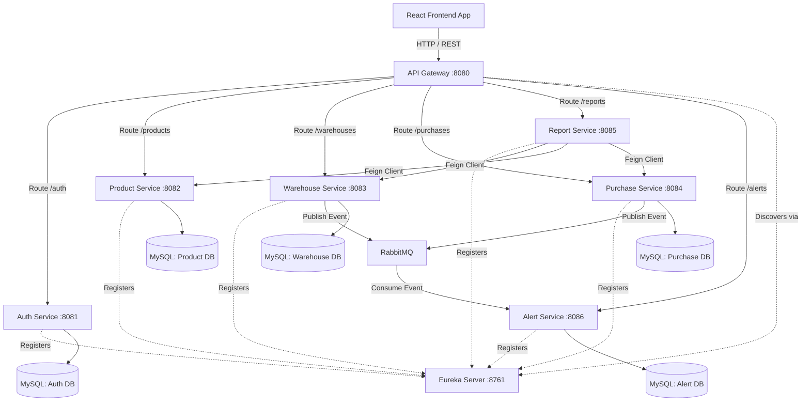
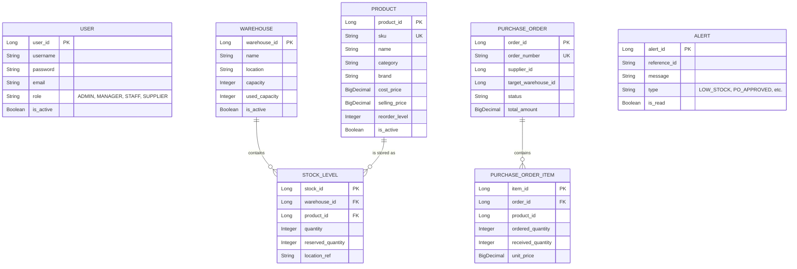

# StockPro Inventory Management System - Project Report

## 1. Overall Project Architecture

StockPro is built on a modern distributed microservices architecture using Spring Boot for the backend and React for the frontend. The system relies on an API Gateway to route traffic, a Eureka Server for service discovery, and RabbitMQ for asynchronous event-driven communication (such as alerts).

## 2. Entity Relationship (ER) Diagrams

Since the architecture follows the Database-per-Service pattern, each microservice manages its own isolated schema. Below is the logical ER representation across the key services.

## 3. Microservices Use Cases

### 3.1 API Gateway & Eureka Server
- **API Gateway**: Acts as the single entry point for the frontend, routing requests to the appropriate downstream microservice. Handles CORS and forwards authorization headers.
- **Eureka Server**: Provides service registry and discovery, allowing microservices to locate each other dynamically without hardcoded URLs.

### 3.2 Auth Service (`auth-service`)
- **Authentication**: Validates user credentials and issues stateless JWT tokens.
- **User Management**: Allows admins to create users, assign roles, and activate/deactivate accounts.

### 3.3 Product Service (`product-service`)
- **Catalog Management**: Create, read, update, deactivate, and delete products.
- **Search & Filter**: Retrieve products by SKU, barcode, category, brand, or text search.
- **Low Stock Monitoring**: Provides specific endpoints to identify products nearing or below their reorder levels.

### 3.4 Warehouse Service (`warehouse-service`)
- **Warehouse Management**: Track locations, capacity, and current utilization.
- **Stock Tracking**: Maintain granular stock levels per warehouse and product. Tracks available vs. reserved quantities.
- **Stock Adjustments**: Process manual stock-ins and stock-outs, ensuring physical counts match system records. Emits low stock events via RabbitMQ when levels drop.

### 3.5 Purchase Service (`purchase-service`)
- **Order Lifecycle**: Create purchase orders in DRAFT state, submit for approval, approve, and mark as delivered.
- **Receiving**: Process item receipts against POs. As items are received, synchronous Feign calls are made to the Warehouse service to increment actual physical stock.
- **Supplier Tracking**: Group and filter POs by assigned supplier.

### 3.6 Report Service (`report-service`)
- **Live Valuation**: Communicates with the Product and Warehouse services in real-time to compute the total financial valuation of all physical inventory.
- **Turnover Calculation**: Aggregates total purchase spend over a selected time period and compares it against live valuation to calculate the Inventory Turnover Rate.

### 3.7 Alert Service (`alert-service`)
- **Event Consumption**: Listens to RabbitMQ queues for system events (e.g., stock falling below reorder level).
- **Notification Persistence**: Saves alerts to the database for users to view in the UI dashboard.
- **Alert Management**: Allows users to mark alerts as read or unread.

## 4. Role Responsibilities

The system implements Role-Based Access Control (RBAC). The following roles dictate authorization boundaries:

| Role | Core Responsibilities & Permissions |
|------|-------------------------------------|
| **ADMIN** | **Superuser Access.** - Full access to all modules. - Manage user accounts (create, activate, deactivate). - Configure system-wide settings. - Approve high-value Purchase Orders. - Access executive Reports and Analytics. |
| **MANAGER** | **Operational Oversight.** - Create and edit Product catalog entries. - Create and manage Warehouses and bin locations. - Initiate and submit Purchase Orders. - Perform global inventory checks and view alerts. |
| **STAFF** | **Day-to-day Execution.** - View product details and locate stock. - Perform manual Stock Adjustments (Stock In / Stock Out). - Receive deliveries against approved Purchase Orders. - Cannot create products or manage users. |
| **SUPPLIER** | **External Partner Access.** - Limited visibility restricted to their specific entity. - View Purchase Orders assigned to them. - Update expected delivery dates for their active orders. |
